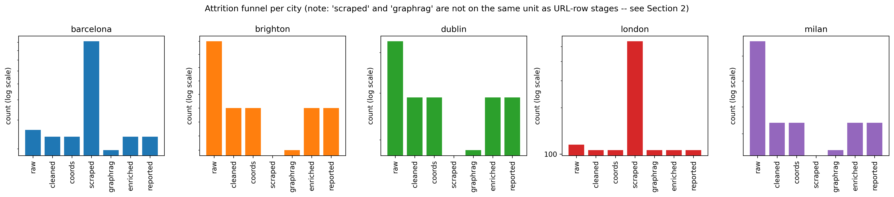
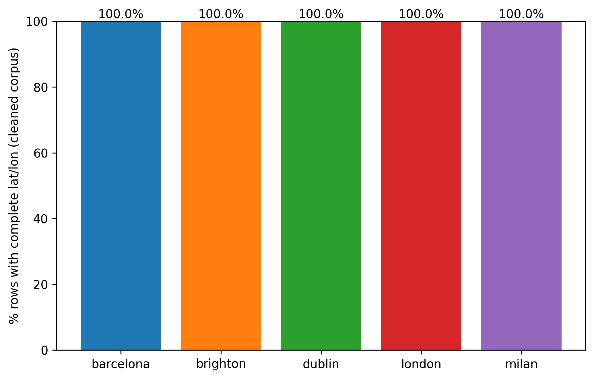
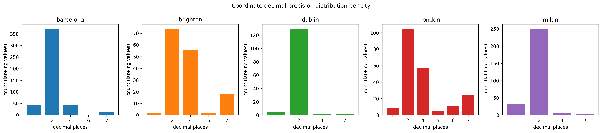
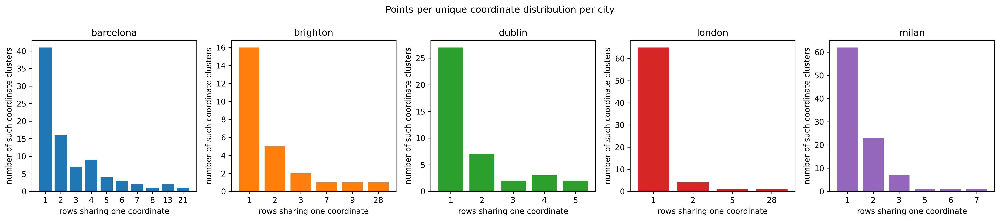
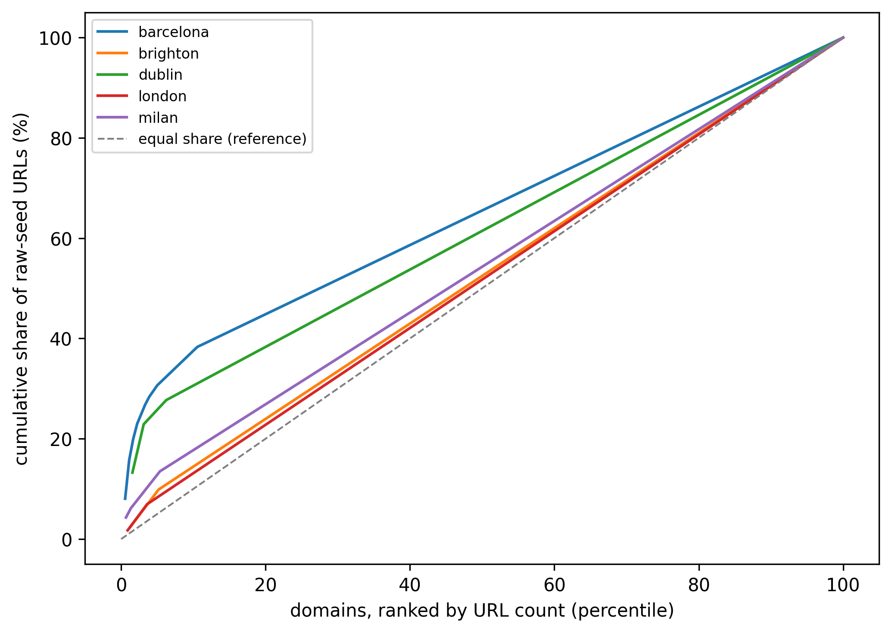
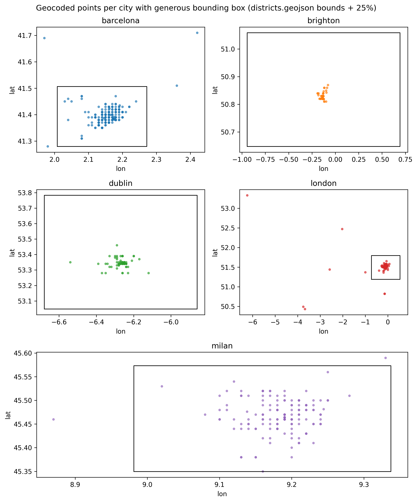
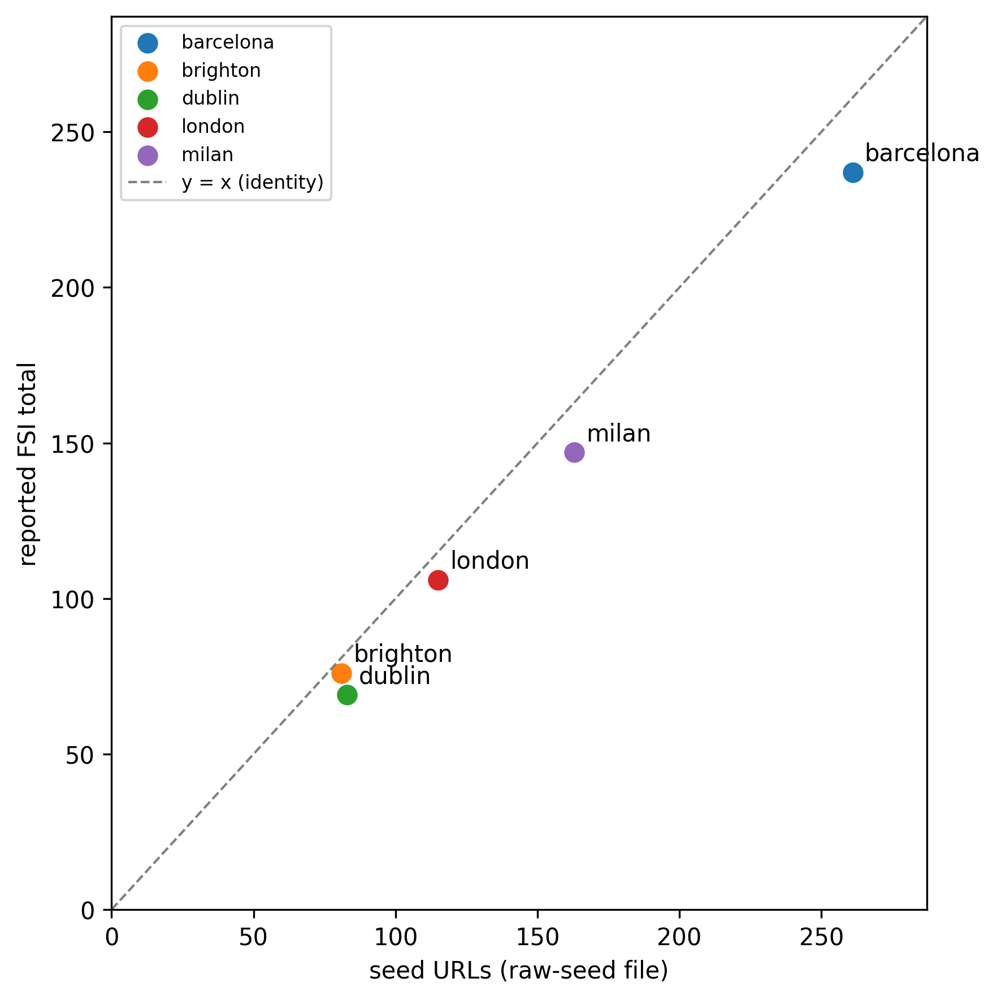

# Corpus Characterisation Analysis

Descriptive analysis of the seed URL corpus and its transformation through the pipeline, computed entirely from files on disk (no pipeline stage was run, no network call was made to produce these numbers). Generated by `analysis/corpus_analysis.py`; rerun that script to regenerate every table, figure and number in this document from scratch.

Cities analysed: barcelona, brighton, dublin, london, milan. NOTUSE/ and NOTUSED_dataset_comparison/ are excluded from this analysis: both are named by the repository owner as not-in-use, and contain an alternate GPT-sourced dataset for a separate comparison arm, not the corpus this chapter characterises.

## 1. Data inventory

Every CSV found under `data/<city>/` for the five active cities, its row count, columns, dtypes and modification time, and which pipeline stage it corresponds to. Classification is evidence-based: it draws on `config/<city>.yaml` (`raw_urls_file` / `urls_file` keys), on `src/phase_0/cleaner.py` (the function that would write `urls.csv` is entirely commented out -- dead code, not run by the current pipeline), and on a byte-level `diff` against `raw_urls.csv` where both files exist for a city.

**Table: CSV lineage inventory** (`tables/01_inventory.csv`)

| city      | path                            | stage                                                                                                                                                  |   row_count |   n_columns | columns                   | dtypes                                             | mtime                         | exists   |
|:----------|:--------------------------------|:-------------------------------------------------------------------------------------------------------------------------------------------------------|------------:|------------:|:--------------------------|:---------------------------------------------------|:------------------------------|:---------|
| barcelona | data/barcelona/urls.csv         | RAW_SEED (proxy: no raw_urls.csv on this branch; verified byte-identical to main branch's raw_urls.csv via git history)                                |         261 |           3 | URL;Lat;Lng               | URL:str;Lat:float64;Lng:float64                    | 2026-07-14T14:53:01.778614998 | True     |
| barcelona | data/barcelona/urls_cleaned.csv | CLEANED (post dedup + dead-link/social-wall removal, combined -- no intermediate file on disk separates these two sub-stages)                          |         237 |           4 | URL;Lat;Lng;coords_approx | URL:str;Lat:float64;Lng:float64;coords_approx:bool | 2026-07-14T14:53:01.778785229 | True     |
| brighton  | data/brighton/raw_urls.csv      | RAW_SEED                                                                                                                                               |          81 |           3 | URL;Lat;Lng               | URL:str;Lat:float64;Lng:float64                    | 2026-07-03T11:44:55.744644165 | True     |
| brighton  | data/brighton/urls.csv          | SUPERSEDED_INTERMEDIATE (urls.csv writer is dead code in src/phase_0/cleaner.py; not consumed by current pipeline; excluded from the attrition ledger) |          81 |           3 | URL;Lat;Lng               | URL:str;Lat:float64;Lng:float64                    | 2026-07-03T11:44:55.744644165 | True     |
| brighton  | data/brighton/urls_cleaned.csv  | CLEANED (post dedup + dead-link/social-wall removal, combined -- no intermediate file on disk separates these two sub-stages)                          |          76 |           4 | URL;Lat;Lng;coords_approx | URL:str;Lat:float64;Lng:float64;coords_approx:bool | 2026-07-03T11:44:55.744644165 | True     |
| dublin    | data/dublin/raw_urls.csv        | RAW_SEED                                                                                                                                               |          83 |           3 | URL;Lat;Lng               | URL:str;Lat:float64;Lng:float64                    | 2026-07-03T11:44:56.923630238 | True     |
| dublin    | data/dublin/urls.csv            | SUPERSEDED_INTERMEDIATE (urls.csv writer is dead code in src/phase_0/cleaner.py; not consumed by current pipeline; excluded from the attrition ledger) |          83 |           3 | URL;Lat;Lng               | URL:str;Lat:float64;Lng:float64                    | 2026-07-03T11:44:56.923630238 | True     |
| dublin    | data/dublin/urls_cleaned.csv    | CLEANED (post dedup + dead-link/social-wall removal, combined -- no intermediate file on disk separates these two sub-stages)                          |          69 |           4 | URL;Lat;Lng;coords_approx | URL:str;Lat:float64;Lng:float64;coords_approx:bool | 2026-07-03T11:44:56.923630238 | True     |
| london    | data/london/raw_urls.csv        | RAW_SEED                                                                                                                                               |         115 |           3 | URL;Lat;Lon               | URL:str;Lat:float64;Lon:float64                    | 2026-07-03T11:44:56.923630238 | True     |
| london    | data/london/urls_cleaned.csv    | CLEANED (post dedup + dead-link/social-wall removal, combined -- no intermediate file on disk separates these two sub-stages)                          |         106 |           4 | URL;Lat;Lng;coords_approx | URL:str;Lat:float64;Lng:float64;coords_approx:bool | 2026-07-14T14:53:03.373380423 | True     |
| milan     | data/milan/raw_urls.csv         | RAW_SEED                                                                                                                                               |         163 |           3 | URL;Lat;Lng               | URL:str;Lat:float64;Lng:float64                    | 2026-07-03T11:44:56.923630238 | True     |
| milan     | data/milan/urls_cleaned.csv     | CLEANED (post dedup + dead-link/social-wall removal, combined -- no intermediate file on disk separates these two sub-stages)                          |         147 |           4 | URL;Lat;Lng;coords_approx | URL:str;Lat:float64;Lng:float64;coords_approx:bool | 2026-07-14T14:53:05.533370256 | True     |

## 2. Attrition ledger

Per-city record survival across pipeline stages. Two caveats, established from the files themselves rather than assumed:

1. **Dedup and dead-link/social-wall removal are reported as one combined stage.** Only one cleaned file exists per city (`urls_cleaned.csv`); no file on disk separates 'post-dedup' from 'post-dead-link-removal'. `data/<city>/output/phase0_annotated.json` reports `duplicates_detected: 0` for every city, but its own `total_input` field matches the *raw* count for Brighton/Dublin and the *cleaned* count for Barcelona/London/Milan -- i.e. it was computed at a different pipeline point per city, so `duplicates_detected` is not a reliable per-city dedup count either (see Data quality issues).
2. **'Successfully scraped' (`data/<city>/raw/` file count) is not on the same unit as the URL-row stages above it.** Filenames in that directory (e.g. multiple `abarkacoop.com_*.html` variants) show it holds a multi-page crawl per seed domain, not one file per seed URL, so its retention percentage against the URL-row stages is not a meaningful comparison; it is reported anyway per the anomaly-reporting rule, flagged rather than omitted.
3. **Merged GraphRAG input docs is a parallel branch, not a strict funnel input to `fsi_enriched.jsonl`.** `fsi_records.jsonl` (pre-enrichment) equals `fsi_enriched.jsonl` exactly in every city, and both are consistently *larger* than the graphrag input doc count -- so FSI records are not simply 1:1 derived from the graphrag-merged document set.

**Table: Attrition ledger: records surviving each stage** (`tables/02_attrition_ledger.csv`)

| city      |   1_raw_seed |   2_cleaned |   3_usable_coords |   4_scraped_files |   5_graphrag_docs |   6_fsi_enriched |   7_reported_fsi_total |   pct_raw_to_cleaned |   pct_cleaned_to_coords |   pct_cleaned_to_scraped |   pct_cleaned_to_graphrag |   pct_cleaned_to_enriched |   pct_end_to_end_raw_to_enriched |   pct_end_to_end_raw_to_reported |
|:----------|-------------:|------------:|------------------:|------------------:|------------------:|-----------------:|-----------------------:|---------------------:|------------------------:|-------------------------:|--------------------------:|--------------------------:|---------------------------------:|---------------------------------:|
| barcelona |          261 |         237 |               237 |               912 |               196 |              237 |                    237 |                 90.8 |                     100 |                    384.8 |                      82.7 |                       100 |                             90.8 |                             90.8 |
| brighton  |           81 |          76 |                76 |                 0 |                73 |               76 |                     76 |                 93.8 |                     100 |                      0   |                      96.1 |                       100 |                             93.8 |                             93.8 |
| dublin    |           83 |          69 |                69 |                 0 |                58 |               69 |                     69 |                 83.1 |                     100 |                      0   |                      84.1 |                       100 |                             83.1 |                             83.1 |
| london    |          115 |         106 |               106 |               540 |               106 |              106 |                    106 |                 92.2 |                     100 |                    509.4 |                     100   |                       100 |                             92.2 |                             92.2 |
| milan     |          163 |         147 |               147 |                 0 |               142 |              147 |                    147 |                 90.2 |                     100 |                      0   |                      96.6 |                       100 |                             90.2 |                             90.2 |

## 3. Per-city descriptive statistics

Computed on each city's raw-seed file (see Section 1 for which file that is per city). `normalize_url()` lowercases scheme/host, strips a leading `www.`, strips one trailing slash from the path, and keeps the query string -- see the function docstring in the script.

**Table: Per-city descriptive statistics (raw-seed file)** (`tables/03_per_city_descriptive_stats.csv`)

| city              |   n_rows |   n_unique_urls_raw |   n_unique_urls_normalised |   duplicate_urls_raw |   duplicate_urls_normalised |   n_unique_domains |   herfindahl_index_0_1 |   herfindahl_index_0_10000 |   domain_share_top1_pct |   domain_share_top3_pct |   domain_share_top10_pct |   n_singleton_domains |   social_platform_share_pct |   pdf_or_nonhtml_share_pct |   homepage_share_pct |   median_path_depth |
|:------------------|---------:|--------------------:|---------------------------:|---------------------:|----------------------------:|-------------------:|-----------------------:|---------------------------:|------------------------:|------------------------:|-------------------------:|----------------------:|----------------------------:|---------------------------:|---------------------:|--------------------:|
| barcelona         |      261 |                 261 |                        261 |                    0 |                           0 |                180 |                 0.0192 |                      192.5 |                     8   |                    19.9 |                     31.4 |                   161 |                         6.1 |                        0   |                 39.8 |                   1 |
| brighton          |       81 |                  81 |                         81 |                    0 |                           0 |                 77 |                 0.0136 |                      135.7 |                     2.5 |                     7.4 |                     17.3 |                    73 |                         0   |                        0   |                 21   |                   1 |
| dublin            |       83 |                  83 |                         83 |                    0 |                           0 |                 64 |                 0.0367 |                      367.3 |                    13.3 |                    25.3 |                     34.9 |                    60 |                        10.8 |                        0   |                 28.9 |                   1 |
| london            |      115 |                 115 |                        115 |                    0 |                           0 |                111 |                 0.0093 |                       93   |                     1.7 |                     5.2 |                     12.2 |                   107 |                         1.7 |                        0   |                 20.9 |                   1 |
| milan             |      163 |                 163 |                        163 |                    0 |                           0 |                149 |                 0.0084 |                       83.9 |                     4.3 |                     7.4 |                     14.7 |                   141 |                         4.3 |                        0.6 |                 43.6 |                   1 |
| ALL_CITIES_POOLED |      703 |                 703 |                        703 |                    0 |                           0 |                563 |                 0.0061 |                       61.1 |                     4.3 |                    11.1 |                     16.9 |                   522 |                         4.8 |                        0.1 |                 34.1 |                   1 |

*`pdf_or_nonhtml_share_pct` is a URL-extension proxy only (`.pdf`, `.docx`, image extensions, etc. in the path) -- actual Content-Type cannot be checked without a network request, which this script does not make; this is a lower bound.*

**Table: TLD distribution per city** (`tables/03b_tld_distribution.csv`)

| city      | tld                  |   count |   share_pct |
|:----------|:---------------------|--------:|------------:|
| barcelona | org                  |      89 |        34.1 |
| barcelona | com                  |      74 |        28.4 |
| barcelona | cat                  |      63 |        24.1 |
| barcelona | es                   |       8 |         3.1 |
| barcelona | barcelona            |       7 |         2.7 |
| barcelona | net                  |       6 |         2.3 |
| barcelona | coop                 |       6 |         2.3 |
| barcelona | com.es               |       2 |         0.8 |
| barcelona | info                 |       2 |         0.8 |
| barcelona | blog                 |       1 |         0.4 |
| barcelona | zone                 |       1 |         0.4 |
| barcelona | org.es               |       1 |         0.4 |
| barcelona | ong                  |       1 |         0.4 |
| brighton  | org.uk               |      30 |        37   |
| brighton  | org                  |      23 |        28.4 |
| brighton  | com                  |      11 |        13.6 |
| brighton  | co.uk                |       7 |         8.6 |
| brighton  | gov.uk               |       2 |         2.5 |
| brighton  | ac.uk                |       1 |         1.2 |
| brighton  | online               |       1 |         1.2 |
| brighton  | uk                   |       1 |         1.2 |
| brighton  | coop                 |       1 |         1.2 |
| brighton  | info                 |       1 |         1.2 |
| brighton  | brighton-hove.sch.uk |       1 |         1.2 |
| brighton  | blog                 |       1 |         1.2 |
| brighton  | nhs.uk               |       1 |         1.2 |
| dublin    | ie                   |      55 |        66.3 |
| dublin    | com                  |      18 |        21.7 |
| dublin    | org                  |       4 |         4.8 |
| dublin    | net                  |       3 |         3.6 |
| dublin    | coop                 |       1 |         1.2 |
| dublin    | cloud                |       1 |         1.2 |
| dublin    | info                 |       1 |         1.2 |
| london    | org                  |      37 |        32.2 |
| london    | org.uk               |      36 |        31.3 |
| london    | com                  |      16 |        13.9 |
| london    | co.uk                |      10 |         8.7 |
| london    | gov.uk               |       7 |         6.1 |
| london    | coop                 |       3 |         2.6 |
| london    | ac.uk                |       2 |         1.7 |
| london    | london               |       1 |         0.9 |
| london    | uk                   |       1 |         0.9 |
| london    | ca                   |       1 |         0.9 |
| london    | eu                   |       1 |         0.9 |
| milan     | it                   |      93 |        57.1 |
| milan     | org                  |      37 |        22.7 |
| milan     | com                  |      23 |        14.1 |
| milan     | milano.it            |       3 |         1.8 |
| milan     | eu                   |       2 |         1.2 |
| milan     | mi.it                |       1 |         0.6 |
| milan     | ee                   |       1 |         0.6 |
| milan     | charity              |       1 |         0.6 |
| milan     | net                  |       1 |         0.6 |
| milan     | edu.it               |       1 |         0.6 |

**Table: Language-of-source proxy: local vs generic vs other-country TLD share** (`tables/03c_language_of_source_proxy.csv`)

| city      |   n |   n_local_tld |   n_generic_tld |   n_other_country_tld |   local_tld_share_pct |   generic_tld_share_pct |   other_country_tld_share_pct | note                                                                      |
|:----------|----:|--------------:|----------------:|----------------------:|----------------------:|------------------------:|------------------------------:|:--------------------------------------------------------------------------|
| barcelona | 261 |            71 |             177 |                    13 |                  27.2 |                    67.8 |                           5   | local TLD set for barcelona: ['cat', 'es', 'eu']                          |
| brighton  |  81 |            40 |              36 |                     5 |                  49.4 |                    44.4 |                           6.2 | local TLD set for brighton: ['co.uk', 'gov.uk', 'org.uk', 'sch.uk', 'uk'] |
| dublin    |  83 |            55 |              27 |                     1 |                  66.3 |                    32.5 |                           1.2 | local TLD set for dublin: ['ie']                                          |
| london    | 115 |            54 |              56 |                     5 |                  47   |                    48.7 |                           4.3 | local TLD set for london: ['co.uk', 'gov.uk', 'org.uk', 'sch.uk', 'uk']   |
| milan     | 163 |            93 |              61 |                     9 |                  57.1 |                    37.4 |                           5.5 | local TLD set for milan: ['it']                                           |

*Language-of-source proxy is TLD-based, not a language-detection result: `local` = the city/country's own ccTLD family (defined in `LOCAL_TLD_BY_CITY` in the script), `generic` = .com/.org/.net/.info/.coop, `other_country` = any other ccTLD. It is a coarse proxy, not a measured fact about page language.*

**Table: URL path depth distribution per city** (`tables/03d_path_depth_distribution.csv`)

| city      |   path_depth |   count |   share_pct |
|:----------|-------------:|--------:|------------:|
| barcelona |            0 |     104 |        39.8 |
| barcelona |            1 |      58 |        22.2 |
| barcelona |            2 |      51 |        19.5 |
| barcelona |            3 |      23 |         8.8 |
| barcelona |            4 |      10 |         3.8 |
| barcelona |            5 |      12 |         4.6 |
| barcelona |            6 |       2 |         0.8 |
| barcelona |            7 |       1 |         0.4 |
| brighton  |            0 |      17 |        21   |
| brighton  |            1 |      33 |        40.7 |
| brighton  |            2 |      16 |        19.8 |
| brighton  |            3 |       6 |         7.4 |
| brighton  |            4 |       6 |         7.4 |
| brighton  |            5 |       2 |         2.5 |
| brighton  |            6 |       1 |         1.2 |
| dublin    |            0 |      24 |        28.9 |
| dublin    |            1 |      31 |        37.3 |
| dublin    |            2 |      16 |        19.3 |
| dublin    |            3 |       9 |        10.8 |
| dublin    |            4 |       2 |         2.4 |
| dublin    |            7 |       1 |         1.2 |
| london    |            0 |      24 |        20.9 |
| london    |            1 |      37 |        32.2 |
| london    |            2 |      37 |        32.2 |
| london    |            3 |       7 |         6.1 |
| london    |            4 |       8 |         7   |
| london    |            5 |       2 |         1.7 |
| milan     |            0 |      71 |        43.6 |
| milan     |            1 |      37 |        22.7 |
| milan     |            2 |      26 |        16   |
| milan     |            3 |      15 |         9.2 |
| milan     |            4 |       9 |         5.5 |
| milan     |            5 |       3 |         1.8 |
| milan     |            6 |       2 |         1.2 |

## 4. Coordinate quality

### 4a. Coordinate coverage

**Table: Coordinate coverage per city (cleaned corpus)** (`tables/04a_coordinate_coverage.csv`)

| city      |   n_rows |   n_complete_pairs |   coverage_pct |
|:----------|---------:|-------------------:|---------------:|
| barcelona |      237 |                237 |            100 |
| brighton  |       76 |                 76 |            100 |
| dublin    |       69 |                 69 |            100 |
| london    |      106 |                106 |            100 |
| milan     |      147 |                147 |            100 |

### 4b. Coordinate decimal precision

**Table: Modal coordinate decimal precision and implied ground resolution** (`tables/04b_coordinate_precision.csv`)

| city      |   n_with_coords |   modal_decimal_places |   modal_dp_share_pct |   mean_latitude_used_for_conversion |   resolution_m_lat_direction |   resolution_m_lon_direction |
|:----------|----------------:|-----------------------:|---------------------:|------------------------------------:|-----------------------------:|-----------------------------:|
| barcelona |             237 |                      2 |                 78.7 |                             41.3962 |                       1113.2 |                        835.1 |
| brighton  |              76 |                      2 |                 48.7 |                             50.8265 |                       1113.2 |                        703.2 |
| dublin    |              69 |                      2 |                 94.2 |                             53.3455 |                       1113.2 |                        664.6 |
| london    |             106 |                      2 |                 49.5 |                             51.5039 |                       1113.2 |                        692.9 |
| milan     |             147 |                      2 |                 85.4 |                             45.4683 |                       1113.2 |                        780.7 |

*Resolution = 10^-modal_dp degrees, converted to metres using 111,320 m/degree latitude (~constant) and 111,320 * cos(mean latitude) m/degree longitude. This is the size of the smallest distinguishable ground offset at the modal precision -- it bounds what district-level assignment can resolve.*

### 4c. Granularity collapse

**Table: Coordinate granularity collapse per city** (`tables/04c_granularity_collapse.csv`)

| city      |   n_rows_with_coords |   n_distinct_coordinate_pairs |   largest_cluster_size |   n_rows_on_a_shared_coordinate |   pct_rows_on_a_shared_coordinate |
|:----------|---------------------:|------------------------------:|-----------------------:|--------------------------------:|----------------------------------:|
| barcelona |                  237 |                            86 |                     21 |                             196 |                              82.7 |
| brighton  |                   76 |                            26 |                     28 |                              60 |                              78.9 |
| dublin    |                   69 |                            41 |                      5 |                              42 |                              60.9 |
| london    |                  106 |                            71 |                     28 |                              41 |                              38.7 |
| milan     |                  147 |                            95 |                      7 |                              85 |                              57.8 |

### 4d. Plausibility: bounding-box outliers

**Table: Generous per-city bounding boxes (districts.geojson total_bounds + 25% margin)** (`tables/04d_city_bounding_boxes.csv`)

| city      |   min_lon |   min_lat |   max_lon |   max_lat |
|:----------|----------:|----------:|----------:|----------:|
| barcelona |  2.00841  |   41.2792 |  2.27197  |   41.5061 |
| brighton  | -0.944095 |   50.6474 |  0.693275 |   51.0589 |
| dublin    | -6.67894  |   53.0473 | -5.85976  |   53.7833 |
| london    | -0.721499 |   51.1855 |  0.545236 |   51.7932 |
| milan     |  8.98127  |   45.3494 |  9.33734  |   45.5733 |

**Table: Rows outside their city's generous bounding box** (`tables/04d_bounding_box_outliers.csv`)

| city      | url                                                                                                                                     |   lat |   lng | coords_approx   | falls_inside_bbox_of   | coarse_geo_reasoning                                                                               |
|:----------|:----------------------------------------------------------------------------------------------------------------------------------------|------:|------:|:----------------|:-----------------------|:---------------------------------------------------------------------------------------------------|
| barcelona | https://fundacioferrersustainability.org/es/green-for-good/el-jardi-fenix                                                               | 41.51 |  2.36 | False           | nan                    | 41.51 deg N, 2.36 deg E -- temperate latitude band, Europe/North Africa/Middle East longitudes     |
| barcelona | https://www.fundacionausolan.org/project/stop-hambre                                                                                    | 41.28 |  1.98 | False           | nan                    | 41.28 deg N, 1.98 deg E -- temperate latitude band, Europe/North Africa/Middle East longitudes     |
| barcelona | https://www.kalart.org/es/descubre-nuestro-jardin-comunitario-cerca-de-barcelona                                                        | 41.71 |  2.42 | False           | nan                    | 41.71 deg N, 2.42 deg E -- temperate latitude band, Europe/North Africa/Middle East longitudes     |
| barcelona | https://www.lesrefardes.coop/es/quienes-somos/somos-red                                                                                 | 41.69 |  1.97 | False           | nan                    | 41.69 deg N, 1.97 deg E -- temperate latitude band, Europe/North Africa/Middle East longitudes     |
| london    | https://transitiontogether.org.uk/eat-grow-share-communities-building-food-resilience                                                   | 50.43 | -3.68 | False           | nan                    | 50.43 deg N, 3.68 deg W -- high-latitude latitude band, Europe/North Africa/Middle East longitudes |
| london    | https://www.londonfreedomseedbank.org                                                                                                   | 50.49 | -3.75 | False           | nan                    | 50.49 deg N, 3.75 deg W -- high-latitude latitude band, Europe/North Africa/Middle East longitudes |
| london    | https://www.alexandrarose.org.uk/press-release-charity-urges-all-parties-to-commit-to-national-fruit-and-veg-on-prescription-programmes | 50.82 | -0.14 | False           | brighton               | 50.82 deg N, 0.14 deg W -- high-latitude latitude band, Europe/North Africa/Middle East longitudes |
| london    | https://www.foodmatters.org/projects/food-roots-incubator                                                                               | 50.82 | -0.14 | False           | brighton               | 50.82 deg N, 0.14 deg W -- high-latitude latitude band, Europe/North Africa/Middle East longitudes |
| london    | https://www.thrive.org.uk/get-gardening/seans-story-gardening-for-connection                                                            | 51.37 | -1    | False           | nan                    | 51.37 deg N, 1.00 deg W -- high-latitude latitude band, Europe/North Africa/Middle East longitudes |
| london    | https://www.neighbourly.com/solution/product-surplus                                                                                    | 51.44 | -2.58 | False           | nan                    | 51.44 deg N, 2.58 deg W -- high-latitude latitude band, Europe/North Africa/Middle East longitudes |
| london    | https://www.yourlocalpantry.co.uk                                                                                                       | 52.47 | -2.03 | False           | nan                    | 52.47 deg N, 2.03 deg W -- high-latitude latitude band, Europe/North Africa/Middle East longitudes |
| london    | https://maps.transitionnetwork.org/group/transition-newham                                                                              | 53.33 | -6.24 | False           | dublin                 | 53.33 deg N, 6.24 deg W -- high-latitude latitude band, Europe/North Africa/Middle East longitudes |
| milan     | https://foodforall.charity/                                                                                                             | 45.59 |  9.33 | False           | nan                    | 45.59 deg N, 9.33 deg E -- temperate latitude band, Europe/North Africa/Middle East longitudes     |
| milan     | https://nondisolopanemagenta.it/                                                                                                        | 45.46 |  8.87 | False           | nan                    | 45.46 deg N, 8.87 deg E -- temperate latitude band, Europe/North Africa/Middle East longitudes     |

### 4e. Nearest-neighbour distances (haversine, distinct points)

**Table: Nearest-neighbour distance (median, IQR) between distinct points** (`tables/04e_nearest_neighbour_distances.csv`)

| city      |   n_distinct_points |   median_nn_m |   iqr_low_m |   iqr_high_m |
|:----------|--------------------:|--------------:|------------:|-------------:|
| barcelona |                  86 |         834.1 |       819.9 |       1112   |
| brighton  |                  26 |         702.3 |       296.4 |        857.8 |
| dublin    |                  41 |         664.1 |       663.8 |       1989.4 |
| london    |                  71 |        1309.8 |       673.2 |       2795   |
| milan     |                  95 |         780.1 |       779.5 |       1112   |

### 4f. District polygon membership

**Table: Geocoded points inside districts.geojson polygons vs report's stated district count** (`tables/04f_district_membership.csv`)

| city      |   n_geocoded_points |   n_districts_in_geojson |   n_distinct_districts_hit_recomputed |   n_points_outside_all_districts |   n_districts_in_final_report | matches_report   |
|:----------|--------------------:|-------------------------:|--------------------------------------:|---------------------------------:|------------------------------:|:-----------------|
| barcelona |                 237 |                       10 |                                    10 |                               35 |                            10 | True             |
| brighton  |                  76 |                       30 |                                     3 |                                0 |                             3 | True             |
| dublin    |                  69 |                       35 |                                    18 |                                1 |                            18 | True             |
| london    |                 106 |                       33 |                                    22 |                                9 |                            22 | True             |
| milan     |                 147 |                        9 |                                     9 |                               12 |                             9 | True             |

## 5. Cross-city checks

**Table: URLs appearing in more than one city's raw file (exact string match)** (`tables/05a_cross_city_urls_exact.csv`)

| url   | cities   |
|-------|----------|

**Table: URLs appearing in more than one city's raw file (normalised match)** (`tables/05b_cross_city_urls_normalised.csv`)

| url_normalised   | cities   |
|------------------|----------|

**Table: Domains appearing in more than one city's raw file** (`tables/05c_cross_city_domains.csv`)

| domain                               |   n_cities | cities                                 |
|:-------------------------------------|-----------:|:---------------------------------------|
| wordpress.com                        |          5 | barcelona;brighton;dublin;london;milan |
| facebook.com                         |          4 | barcelona;dublin;london;milan          |
| home.blog                            |          2 | barcelona;brighton                     |
| blogspot.com                         |          2 | barcelona;brighton                     |
| instagram.com                        |          2 | barcelona;dublin                       |
| wearephenix.com                      |          2 | barcelona;milan                        |
| santegidio.org                       |          2 | barcelona;milan                        |
| communitysupportedagriculture.org.uk |          2 | brighton;london                        |
| foodmatters.org                      |          2 | brighton;london                        |
| foodcycle.org.uk                     |          2 | brighton;london                        |
| seedsovereignty.info                 |          2 | brighton;dublin                        |
| sustainablefoodplaces.org            |          2 | brighton;london                        |
| ukharvest.org.uk                     |          2 | brighton;london                        |

**Table: Coordinates from city A's cleaned corpus falling inside city B's bounding box** (`tables/05d_cross_city_bbox_overlap.csv`)

| city_of_point   | bbox_of_city   |   n_points_inside |
|:----------------|:---------------|------------------:|
| london          | brighton       |                 2 |
| london          | dublin         |                 1 |

## 6. External validation against the baseline screening ledger

`appendix_reports/report_<city>_baseline.pdf` contains a per-URL screening table (columns `# | Candidate | Decision | Type | Operational model | Activity evidence or discard reason | Location`). No `_chatgpt.html` cross-check export exists on disk for any of these five cities, so the two-parser cross-check used elsewhere in this repo (`src/phase_6_v2/lib/ledger_parser.py`) cannot run here. Instead this script reads the PDF directly with PyMuPDF: row-number tokens in the left-hand column give each row's page and y-position; the row's 'Candidate' hyperlink (a PDF link annotation, not the wrapped/hyphenated display text) gives its source URL; 'Retained'/'Discarded' is read from the row's text band. This was validated against all five PDFs before being folded into this script: extracted row counts equal the raw-seed count for every city (Barcelona 261/261, Brighton 81/81, Dublin 83/83, London 115/115, Milan 163/163), and Barcelona's retained count from this extraction is 44/261, matching the '44 retained initiatives' stated in the report's own prose.

**Table: Baseline ledger extraction summary per city** (`tables/06a_ledger_extraction_summary.csv`)

| city      |   n_ledger_rows |   n_retained |   n_discarded |   n_decision_unknown |   n_rows_no_url_extracted |   n_rows_ambiguous_multi_url |   n_raw_seed_urls | row_count_matches_raw_seed   |
|:----------|----------------:|-------------:|--------------:|---------------------:|--------------------------:|-----------------------------:|------------------:|:-----------------------------|
| barcelona |             261 |           44 |           215 |                    2 |                         6 |                            0 |               261 | True                         |
| brighton  |              81 |           30 |            51 |                    0 |                         0 |                            0 |                81 | True                         |
| dublin    |              83 |           38 |            45 |                    0 |                         1 |                            0 |                83 | True                         |
| london    |             115 |           34 |            80 |                    1 |                         4 |                            0 |               115 | True                         |
| milan     |             163 |           29 |           134 |                    0 |                         3 |                            0 |               163 | True                         |

**Table: My cleaning decision x ledger decision (normalised-URL-matched rows only)** (`tables/06b_confusion_matrix.csv`)

| city      | my_decision   | ledger_decision   |   n |
|:----------|:--------------|:------------------|----:|
| barcelona | kept          | Retained          |  42 |
| barcelona | kept          | Discarded         | 190 |
| barcelona | discarded     | Retained          |   0 |
| barcelona | discarded     | Discarded         |  23 |
| brighton  | kept          | Retained          |  30 |
| brighton  | kept          | Discarded         |  46 |
| brighton  | discarded     | Retained          |   0 |
| brighton  | discarded     | Discarded         |   5 |
| dublin    | kept          | Retained          |  37 |
| dublin    | kept          | Discarded         |  31 |
| dublin    | discarded     | Retained          |   0 |
| dublin    | discarded     | Discarded         |  14 |
| london    | kept          | Retained          |  31 |
| london    | kept          | Discarded         |  71 |
| london    | discarded     | Retained          |   1 |
| london    | discarded     | Discarded         |   8 |
| milan     | kept          | Retained          |  29 |
| milan     | kept          | Discarded         | 116 |
| milan     | discarded     | Retained          |   0 |
| milan     | discarded     | Discarded         |  15 |

*Cross-tabulated only over ledger rows whose extracted candidate URL matches (after normalisation) a URL in my raw-seed file for that city -- see `06a_ledger_extraction_summary.csv` for the match rate. Neither source is treated as ground truth; this reports agreement/disagreement between two independently produced judgements.*

**Table: Ledger's stated discard reason for URLs my cleaning kept, by reason bucket** (`tables/06c_discard_reason_breakdown_for_urls_i_kept.csv`)

| city      | reason_bucket                     |   n_urls_i_kept |
|:----------|:----------------------------------|----------------:|
| barcelona | inaccessible_or_directory_generic |             163 |
| barcelona | archival_or_ended                 |              12 |
| barcelona | outside_city_or_region            |               7 |
| barcelona | duplicate                         |               5 |
| barcelona | other_or_unclassified             |               3 |
| brighton  | other_or_unclassified             |              24 |
| brighton  | directory_policy_only             |               7 |
| brighton  | inaccessible_only                 |               7 |
| brighton  | duplicate                         |               6 |
| brighton  | archival_or_ended                 |               2 |
| dublin    | other_or_unclassified             |              27 |
| dublin    | directory_policy_only             |               2 |
| dublin    | inaccessible_only                 |               1 |
| dublin    | archival_or_ended                 |               1 |
| london    | directory_policy_only             |              33 |
| london    | other_or_unclassified             |              24 |
| london    | archival_or_ended                 |              10 |
| london    | duplicate                         |               4 |
| milan     | other_or_unclassified             |              43 |
| milan     | directory_policy_only             |              43 |
| milan     | outside_city_or_region            |              14 |
| milan     | duplicate                         |              10 |
| milan     | archival_or_ended                 |               6 |

*`inaccessible_or_directory_generic` is the ledger's own catch-all template sentence ('The page was inaccessible or did not provide sufficient initiative-level evidence; it was a directory, policy, campaign, commercial or unrelated page...') -- it cites accessibility and page-type reasons in the same sentence for most discarded rows, so it cannot be cleanly split into 'dead/inaccessible' vs 'directory/policy' from the ledger text alone. Rows with a more specific reason (duplicate, outside-city, archival) are broken out separately; only rows with a reason string matching neither the generic template nor a specific pattern fall into `other_or_unclassified`.*

## 7. Corpus size vs reported findings

**Table: Corpus size vs reported findings, per city** (`tables/07a_corpus_size_vs_reported_findings.csv`)

| city      |   seed_urls |   cleaned_urls |   enriched_records |   reported_fsi_total |   reported_district_count |   n_distinct_fsi_types |   ratio_reported_fsi_to_seed_urls |
|:----------|------------:|---------------:|-------------------:|---------------------:|--------------------------:|-----------------------:|----------------------------------:|
| barcelona |         261 |            237 |                237 |                  237 |                        10 |                      9 |                             0.908 |
| brighton  |          81 |             76 |                 76 |                   76 |                         3 |                      7 |                             0.938 |
| dublin    |          83 |             69 |                 69 |                   69 |                        18 |                      7 |                             0.831 |
| london    |         115 |            106 |                106 |                  106 |                        22 |                      9 |                             0.922 |
| milan     |         163 |            147 |                147 |                  147 |                         9 |                      9 |                             0.902 |

**Table: Pearson correlation, corpus size (cleaned_urls) vs headline reported figures (n=5 cities)** (`tables/07b_correlations.csv`)

| x            | y                       |   n |   pearson_r |
|:-------------|:------------------------|----:|------------:|
| cleaned_urls | reported_fsi_total      |   5 |       1     |
| cleaned_urls | reported_district_count |   5 |      -0.182 |
| cleaned_urls | n_distinct_fsi_types    |   5 |       0.724 |

*n=5: any correlation here is descriptive of these five cities only, not a generalisable statistical result.*

**Table: Evidence: is the reported FSI total a count of source documents or of distinct initiatives?** (`tables/07c_documents_vs_initiatives_evidence.csv`)

| city      |   cleaned_urls |   fsi_enriched_records | urls_equal_records_1to1   |   n_domains_contributing_gt1_url |   n_urls_on_those_domains |
|:----------|---------------:|-----------------------:|:--------------------------|---------------------------------:|--------------------------:|
| barcelona |            237 |                    237 | True                      |                               17 |                        84 |
| brighton  |             76 |                     76 | True                      |                                4 |                         8 |
| dublin    |             69 |                     69 | True                      |                                3 |                        15 |
| london    |            106 |                    106 | True                      |                                2 |                         4 |
| milan     |            147 |                    147 | True                      |                                7 |                        15 |

*Every city's cleaned-URL count equals its `fsi_enriched.jsonl` record count exactly (see `urls_equal_records_1to1`) -- i.e. `facts['total']` in the rendered report (`src/phase_5/data_extractor.py:105`, `total = len(records)`) is one record per surviving URL, with no URL-to-initiative merging step anywhere in the pipeline. Where multiple distinct URLs on the same domain both survive cleaning (`n_domains_contributing_gt1_url` > 0), each contributes its own FSI record, so a single organisation with several scraped pages can inflate the reported total by more than one. This is direct, file-grounded evidence that the reported FSI totals are counts of surviving source documents, not counts of independently verified distinct initiatives.*

## 8. Figures

*Attrition funnel per city, all seven stages, log-scaled y-axis*

*Coordinate coverage per city, cleaned corpus*

*Distribution of decimal places in lat/lng values, per city*

*How many rows share each distinct coordinate, per city*

*Domain concentration curve, raw-seed file, per city*

*Per-city scatter of geocoded points with bounding box*

*Seed URLs vs reported FSI total, with y=x identity line*

## Data quality issues found

Every anomaly below was produced by the checks in this script; each is reported as found, not corrected, imputed, or dropped.

**Table: All anomalies found, with evidence** (`tables/09_data_quality_issues.csv`)

| section                         | summary                                                                                                                                                                                    | evidence                                                                                                                                                                                                                                                                                                                                                                                  |
|:--------------------------------|:-------------------------------------------------------------------------------------------------------------------------------------------------------------------------------------------|:------------------------------------------------------------------------------------------------------------------------------------------------------------------------------------------------------------------------------------------------------------------------------------------------------------------------------------------------------------------------------------------|
| 1. Inventory                    | barcelona: no raw_urls.csv on disk on this branch (multilingual)                                                                                                                           | config/barcelona.yaml declares raw_urls_file: data/barcelona/raw_urls.csv, but that file does not exist in the working tree on this branch. `git show main:data/barcelona/raw_urls.csv` (commit d80cd64) is 0-diff byte-identical to the current data/barcelona/urls.csv (262 lines incl. header). urls.csv is used here as the raw-seed proxy for Barcelona only, per user confirmation. |
| 2. Attrition ledger             | barcelona: count INCREASES from 2_cleaned (237) to 4_scraped_files (912)                                                                                                                   | analysis/tables/02_attrition_ledger.csv, row city=barcelona                                                                                                                                                                                                                                                                                                                               |
| 2. Attrition ledger             | barcelona: count INCREASES from 5_graphrag_docs (196) to 6_fsi_enriched (237)                                                                                                              | analysis/tables/02_attrition_ledger.csv, row city=barcelona                                                                                                                                                                                                                                                                                                                               |
| 2. Attrition ledger             | brighton: count INCREASES from 5_graphrag_docs (73) to 6_fsi_enriched (76)                                                                                                                 | analysis/tables/02_attrition_ledger.csv, row city=brighton                                                                                                                                                                                                                                                                                                                                |
| 2. Attrition ledger             | brighton: data/brighton/raw/ contains 0 files -- 'successfully scraped' stage is empty                                                                                                     | data/brighton/raw/ (directory empty or missing) vs 76 cleaned URLs                                                                                                                                                                                                                                                                                                                        |
| 2. Attrition ledger             | dublin: count INCREASES from 5_graphrag_docs (58) to 6_fsi_enriched (69)                                                                                                                   | analysis/tables/02_attrition_ledger.csv, row city=dublin                                                                                                                                                                                                                                                                                                                                  |
| 2. Attrition ledger             | dublin: data/dublin/raw/ contains 0 files -- 'successfully scraped' stage is empty                                                                                                         | data/dublin/raw/ (directory empty or missing) vs 69 cleaned URLs                                                                                                                                                                                                                                                                                                                          |
| 2. Attrition ledger             | london: count INCREASES from 2_cleaned (106) to 4_scraped_files (540)                                                                                                                      | analysis/tables/02_attrition_ledger.csv, row city=london                                                                                                                                                                                                                                                                                                                                  |
| 2. Attrition ledger             | milan: count INCREASES from 5_graphrag_docs (142) to 6_fsi_enriched (147)                                                                                                                  | analysis/tables/02_attrition_ledger.csv, row city=milan                                                                                                                                                                                                                                                                                                                                   |
| 2. Attrition ledger             | milan: data/milan/raw/ contains 0 files -- 'successfully scraped' stage is empty                                                                                                           | data/milan/raw/ (directory empty or missing) vs 147 cleaned URLs                                                                                                                                                                                                                                                                                                                          |
| 4c. Granularity collapse        | barcelona: 21 rows share one identical coordinate pair                                                                                                                                     | analysis/tables/04c_granularity_collapse.csv, row city=barcelona                                                                                                                                                                                                                                                                                                                          |
| 4c. Granularity collapse        | brighton: 28 rows share one identical coordinate pair                                                                                                                                      | analysis/tables/04c_granularity_collapse.csv, row city=brighton                                                                                                                                                                                                                                                                                                                           |
| 4c. Granularity collapse        | dublin: 5 rows share one identical coordinate pair                                                                                                                                         | analysis/tables/04c_granularity_collapse.csv, row city=dublin                                                                                                                                                                                                                                                                                                                             |
| 4c. Granularity collapse        | london: 28 rows share one identical coordinate pair                                                                                                                                        | analysis/tables/04c_granularity_collapse.csv, row city=london                                                                                                                                                                                                                                                                                                                             |
| 4c. Granularity collapse        | milan: 7 rows share one identical coordinate pair                                                                                                                                          | analysis/tables/04c_granularity_collapse.csv, row city=milan                                                                                                                                                                                                                                                                                                                              |
| 4d. Plausibility                | barcelona: out-of-bbox point at (41.51, 2.36) -- url=https://fundacioferrersustainability.org/es/green-for-good/el-jardi-fenix                                                             | falls_inside_bbox_of=none of the other 4 listed cities' bboxes; 41.51 deg N, 2.36 deg E -- temperate latitude band, Europe/North Africa/Middle East longitudes                                                                                                                                                                                                                            |
| 4d. Plausibility                | barcelona: out-of-bbox point at (41.28, 1.98) -- url=https://www.fundacionausolan.org/project/stop-hambre                                                                                  | falls_inside_bbox_of=none of the other 4 listed cities' bboxes; 41.28 deg N, 1.98 deg E -- temperate latitude band, Europe/North Africa/Middle East longitudes                                                                                                                                                                                                                            |
| 4d. Plausibility                | barcelona: out-of-bbox point at (41.71, 2.42) -- url=https://www.kalart.org/es/descubre-nuestro-jardin-comunitario-cerca-de-barcelona                                                      | falls_inside_bbox_of=none of the other 4 listed cities' bboxes; 41.71 deg N, 2.42 deg E -- temperate latitude band, Europe/North Africa/Middle East longitudes                                                                                                                                                                                                                            |
| 4d. Plausibility                | barcelona: out-of-bbox point at (41.69, 1.97) -- url=https://www.lesrefardes.coop/es/quienes-somos/somos-red                                                                               | falls_inside_bbox_of=none of the other 4 listed cities' bboxes; 41.69 deg N, 1.97 deg E -- temperate latitude band, Europe/North Africa/Middle East longitudes                                                                                                                                                                                                                            |
| 4d. Plausibility                | london: out-of-bbox point at (50.43, -3.68) -- url=https://transitiontogether.org.uk/eat-grow-share-communities-building-food-resilience                                                   | falls_inside_bbox_of=none of the other 4 listed cities' bboxes; 50.43 deg N, 3.68 deg W -- high-latitude latitude band, Europe/North Africa/Middle East longitudes                                                                                                                                                                                                                        |
| 4d. Plausibility                | london: out-of-bbox point at (50.49, -3.75) -- url=https://www.londonfreedomseedbank.org                                                                                                   | falls_inside_bbox_of=none of the other 4 listed cities' bboxes; 50.49 deg N, 3.75 deg W -- high-latitude latitude band, Europe/North Africa/Middle East longitudes                                                                                                                                                                                                                        |
| 4d. Plausibility                | london: out-of-bbox point at (50.82, -0.14) -- url=https://www.alexandrarose.org.uk/press-release-charity-urges-all-parties-to-commit-to-national-fruit-and-veg-on-prescription-programmes | falls_inside_bbox_of=brighton; 50.82 deg N, 0.14 deg W -- high-latitude latitude band, Europe/North Africa/Middle East longitudes                                                                                                                                                                                                                                                         |
| 4d. Plausibility                | london: out-of-bbox point at (50.82, -0.14) -- url=https://www.foodmatters.org/projects/food-roots-incubator                                                                               | falls_inside_bbox_of=brighton; 50.82 deg N, 0.14 deg W -- high-latitude latitude band, Europe/North Africa/Middle East longitudes                                                                                                                                                                                                                                                         |
| 4d. Plausibility                | london: out-of-bbox point at (51.37, -1.0) -- url=https://www.thrive.org.uk/get-gardening/seans-story-gardening-for-connection                                                             | falls_inside_bbox_of=none of the other 4 listed cities' bboxes; 51.37 deg N, 1.00 deg W -- high-latitude latitude band, Europe/North Africa/Middle East longitudes                                                                                                                                                                                                                        |
| 4d. Plausibility                | london: out-of-bbox point at (51.44, -2.58) -- url=https://www.neighbourly.com/solution/product-surplus                                                                                    | falls_inside_bbox_of=none of the other 4 listed cities' bboxes; 51.44 deg N, 2.58 deg W -- high-latitude latitude band, Europe/North Africa/Middle East longitudes                                                                                                                                                                                                                        |
| 4d. Plausibility                | london: out-of-bbox point at (52.47, -2.03) -- url=https://www.yourlocalpantry.co.uk                                                                                                       | falls_inside_bbox_of=none of the other 4 listed cities' bboxes; 52.47 deg N, 2.03 deg W -- high-latitude latitude band, Europe/North Africa/Middle East longitudes                                                                                                                                                                                                                        |
| 4d. Plausibility                | london: out-of-bbox point at (53.33, -6.24) -- url=https://maps.transitionnetwork.org/group/transition-newham                                                                              | falls_inside_bbox_of=dublin; 53.33 deg N, 6.24 deg W -- high-latitude latitude band, Europe/North Africa/Middle East longitudes                                                                                                                                                                                                                                                           |
| 4d. Plausibility                | milan: out-of-bbox point at (45.59, 9.33) -- url=https://foodforall.charity/                                                                                                               | falls_inside_bbox_of=none of the other 4 listed cities' bboxes; 45.59 deg N, 9.33 deg E -- temperate latitude band, Europe/North Africa/Middle East longitudes                                                                                                                                                                                                                            |
| 4d. Plausibility                | milan: out-of-bbox point at (45.46, 8.87) -- url=https://nondisolopanemagenta.it/                                                                                                          | falls_inside_bbox_of=none of the other 4 listed cities' bboxes; 45.46 deg N, 8.87 deg E -- temperate latitude band, Europe/North Africa/Middle East longitudes                                                                                                                                                                                                                            |
| 4f. District polygon membership | barcelona: 35 geocoded point(s) fall outside every polygon in districts.geojson                                                                                                            | data/barcelona/districts.geojson                                                                                                                                                                                                                                                                                                                                                          |
| 4f. District polygon membership | dublin: 1 geocoded point(s) fall outside every polygon in districts.geojson                                                                                                                | data/dublin/districts.geojson                                                                                                                                                                                                                                                                                                                                                             |
| 4f. District polygon membership | london: 9 geocoded point(s) fall outside every polygon in districts.geojson                                                                                                                | data/london/districts.geojson                                                                                                                                                                                                                                                                                                                                                             |
| 4f. District polygon membership | milan: 12 geocoded point(s) fall outside every polygon in districts.geojson                                                                                                                | data/milan/districts.geojson                                                                                                                                                                                                                                                                                                                                                              |
| 6. Ledger validation            | barcelona: 2 ledger row(s) with neither 'Retained' nor 'Discarded' detected                                                                                                                | appendix_reports/report_barcelona_baseline.pdf, row_id in [238, 253]                                                                                                                                                                                                                                                                                                                      |
| 6. Ledger validation            | barcelona: 6 ledger row(s) had no extractable candidate-column hyperlink                                                                                                                   | appendix_reports/report_barcelona_baseline.pdf, row_id in [75, 100, 112, 187, 238, 253]                                                                                                                                                                                                                                                                                                   |
| 6. Ledger validation            | dublin: 1 ledger row(s) had no extractable candidate-column hyperlink                                                                                                                      | appendix_reports/report_dublin_baseline.pdf, row_id in [27]                                                                                                                                                                                                                                                                                                                               |
| 6. Ledger validation            | london: 1 ledger row(s) with neither 'Retained' nor 'Discarded' detected                                                                                                                   | appendix_reports/report_london_baseline.pdf, row_id in [36]                                                                                                                                                                                                                                                                                                                               |
| 6. Ledger validation            | london: 4 ledger row(s) had no extractable candidate-column hyperlink                                                                                                                      | appendix_reports/report_london_baseline.pdf, row_id in [5, 36, 41, 67]                                                                                                                                                                                                                                                                                                                    |
| 6. Ledger validation            | milan: 3 ledger row(s) had no extractable candidate-column hyperlink                                                                                                                       | appendix_reports/report_milan_baseline.pdf, row_id in [79, 99, 135]                                                                                                                                                                                                                                                                                                                       |
